# UnifiedComms

[](https://developer.android.com/about/versions/12)
[](https://kotlinlang.org)
[](https://developer.android.com/jetpack/compose)
[](LICENSE)

> **A unified communication app for Android** — sync email, calendar, tasks, and messages across multiple accounts. Zero telemetry. Local-first. Encrypted by default.

---

## 🎯 Philosophy

**Data structures first.** Everything flows from the models: `Account`, `Email`, `CalendarEvent`, `Task`, `Message`, `Conversation`, `UnifiedContact`. No telemetry, no tracking, no data leaves your device without explicit consent.

---

## 📱 Screenshots

Captured from the running app (debug build, light + dark themes, seeded demo data).

| | Light | Dark |
|---|---|---|
| **Inbox** | 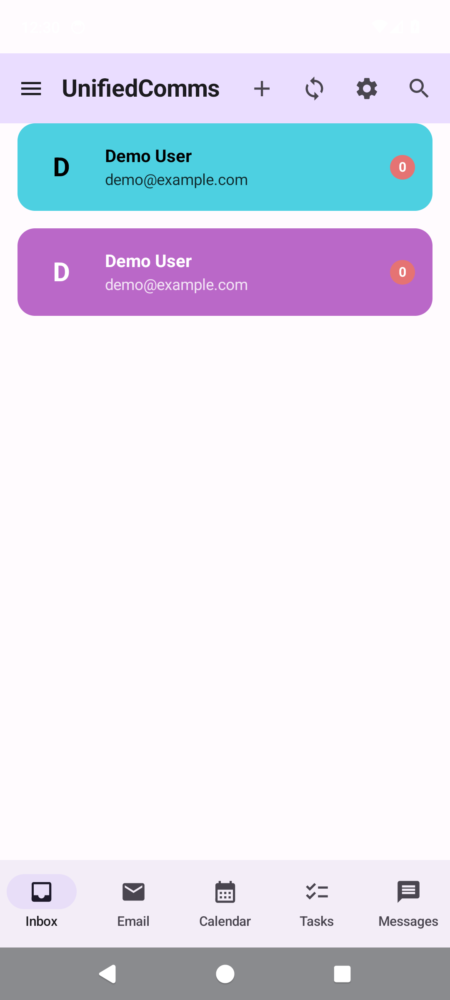 | 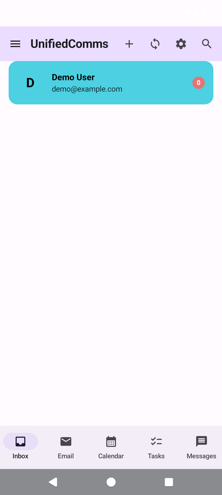 |
| **Email — Account Overview** | 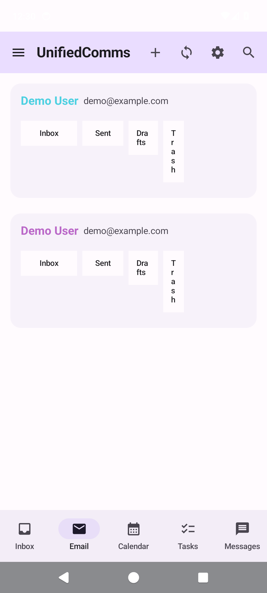 | — |
| **Email — Unified Inbox** | 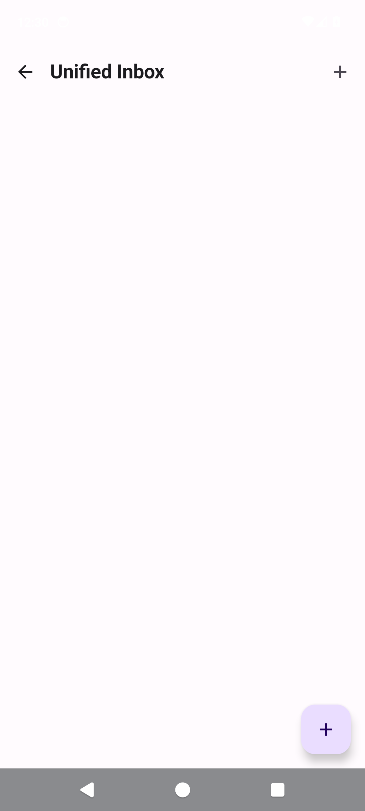 | — |
| **Calendar** | 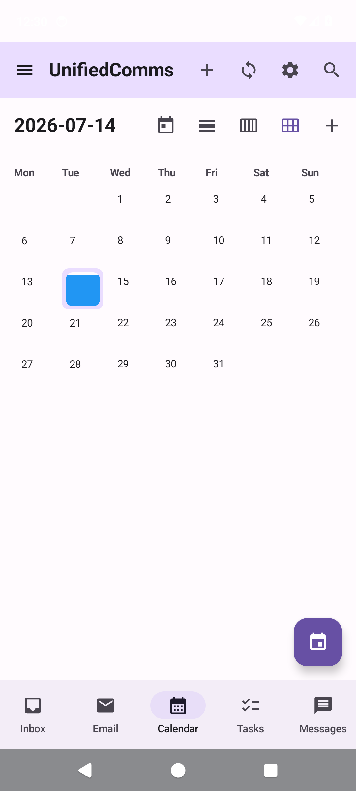 | 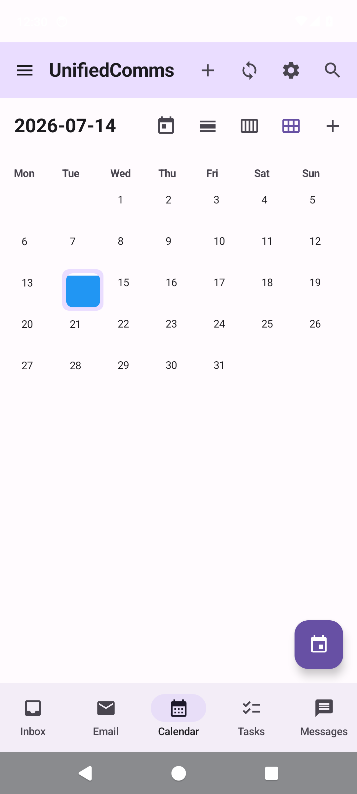 |
| **Tasks** | 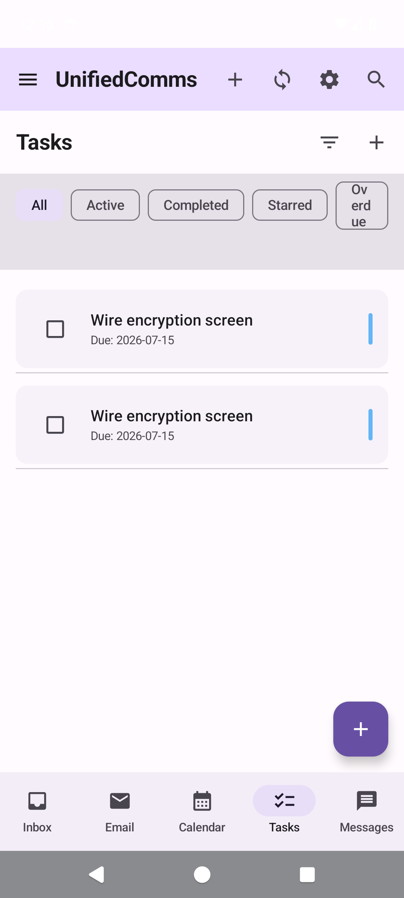 | 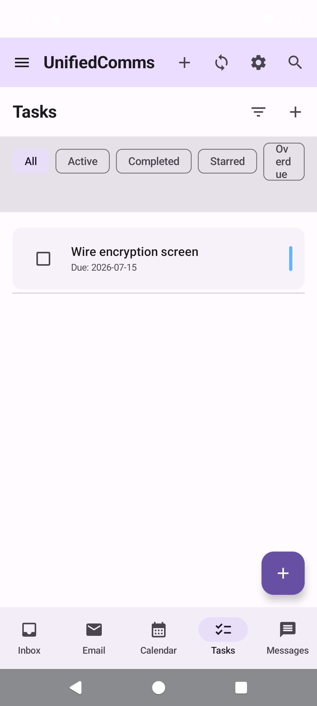 |
| **Messages** | 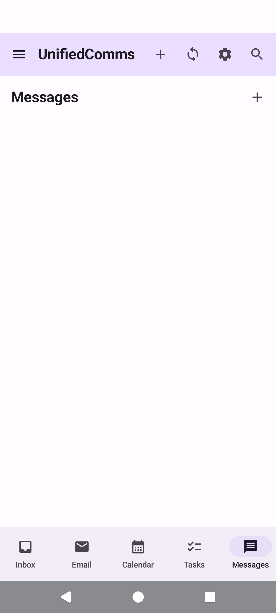 | — |
| **Settings** | 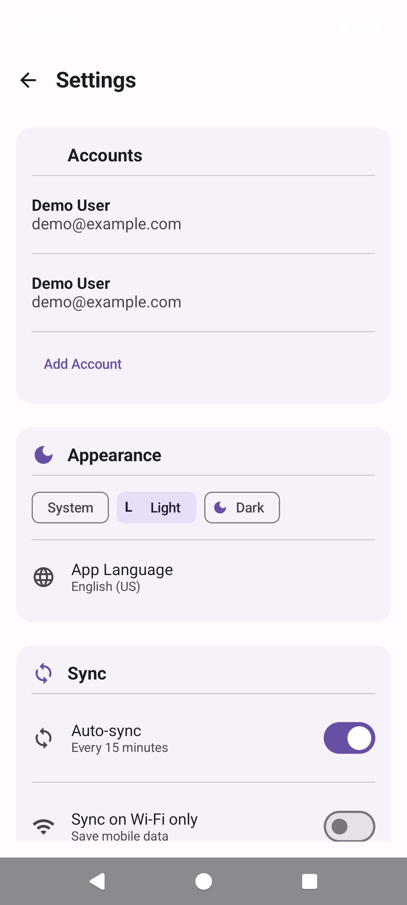 | 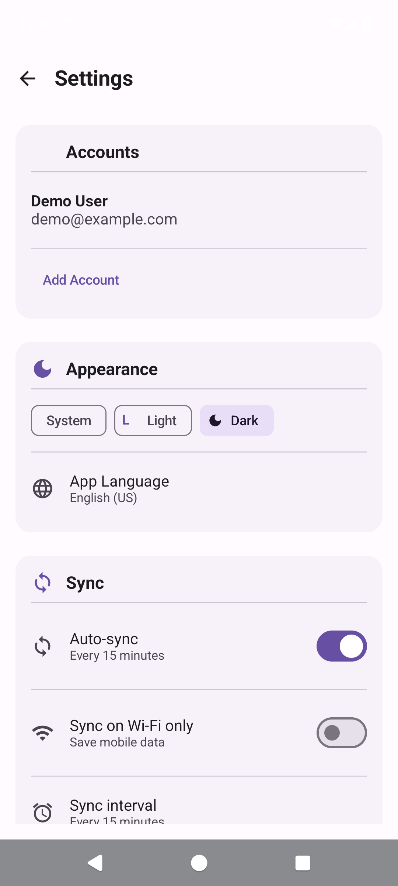 |
| **Add Account** | 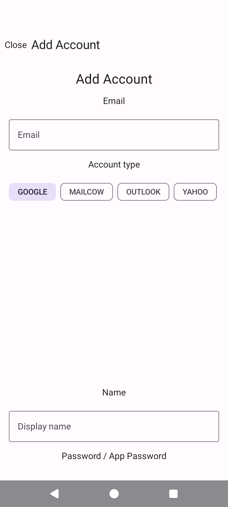 | — |
| **Search** | 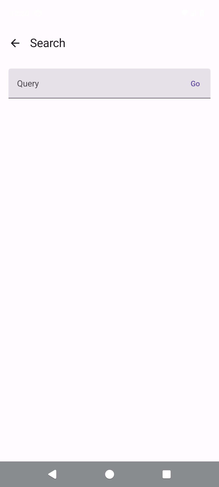 | — |

---

## ✨ Features Overview

| Feature | Providers | Key Capabilities |
|---------|-----------|------------------|
| **📧 Email** | Google, Mailcow, Outlook, Yahoo, Exchange, iCloud, Generic IMAP/SMTP | Unified inbox, push, attachments, PGP, threading, flags |
| **📅 Calendar** | Google, CalDAV, Exchange, iCloud | Shared calendars, color preservation, invites (Yes/No/Maybe), RRULE recurrence |
| **✅ Tasks** | CalDAV VTODO, Google Tasks | Subtasks, priorities (Low/Normal/High/Urgent), due dates, recurring |
| **💬 Messaging** | UnifiedComms users only | Direct/group/broadcast conversations, rich sharing (emails, events, tasks, calendar invites) |
| **🔒 Security** | — | Biometric lock, AES-256 for stored credentials (Android Keystore), zero telemetry |
| **🔔 Reminders** | AlarmManager | Full-screen heads-up alerts with snooze/dismiss |

---

## 🚀 Quick Start

### Prerequisites
- Android 12+ (API 31)
- Kotlin 1.9+, Gradle 8.9+, Java 17
- Android SDK 35

### Build

```bash
git clone https://github.com/Dvalin21/UnifiedComms.git
cd UnifiedComms

# Copy and configure local properties
cp local.properties.example local.properties
# Edit local.properties with your SDK path and signing keys

# Set OAuth credentials (environment variables or local.properties)
export GOOGLE_CLIENT_ID="your_google_client_id"
export MICROSOFT_CLIENT_ID="your_microsoft_client_id"
export YAHOO_CLIENT_ID="your_yahoo_client_id"
export APPLE_CLIENT_ID="your_apple_client_id"
export PUSH_API_KEY="your_push_server_key"

# Build debug APK
./gradlew assembleDebug

# Build release APK (requires signing config)
./gradlew assembleRelease

# Build release AAB
./gradlew bundleRelease
```

### Install

```bash
# Debug
adb install app/build/outputs/apk/debug/app-debug.apk

# Or use Android Studio → Run → Run 'app'
```

---

## 📖 Feature Usage Guide

### 1. Adding Accounts

**Settings → Accounts → Add Account**

| Provider | Method | Required Info |
|----------|--------|---------------|
| **Google** | OAuth 2.0 | Opens browser → grant permissions (Gmail, Calendar, Contacts, Tasks) |
| **Outlook / Hotmail** | OAuth 2.0 | Opens browser → grant permissions (Mail, Calendar, Contacts, Tasks) |
| **Yahoo Mail** | OAuth 2.0 | Opens browser → grant permissions |
| **iCloud** | OAuth 2.0 | Opens browser → Apple ID login |
| **Exchange / Office 365** | OAuth 2.0 (cloud) or Manual | For on-prem: server URL, email, password |
| **Mailcow** | Manual | Server URL (e.g., `mail.example.com`), email, password/app password |
| **Generic IMAP/SMTP** | Manual | IMAP host, SMTP host, ports, email, password |
| **Generic CalDAV/CardDAV** | Manual | CalDAV URL, CardDAV URL, email, password |

**After adding:**
- Choose sync options: Email, Calendar, Contacts, Tasks (per-account)
- Set as **Default Account** for new emails/events/tasks
- Configure sync interval (15 min default), Wi-Fi only, push notifications

---

### 2. Email — Unified Inbox

**Main Screen → Inbox Tab**

- **Unified view**: All accounts in one list, color-coded by account
- **Per-account folders**: Tap account card → INBOX, Sent, Drafts, Trash, Spam, Archive
- **Actions**: Swipe or long-press → Star, Mark Read/Unread, Archive, Delete, Move, Flag
- **Search**: Top-app-bar search → queries subject, sender, body across all accounts
- **Compose**: FAB → New Email → auto-uses default account (or select)
- **Attachments**: View inline (images/PDFs), download, share
- **Threading**: Conversation view with expand/collapse

**Keyboard Shortcuts (external keyboard):**
| Key | Action |
|-----|--------|
| `C` | Compose new |
| `R` | Reply |
| `A` | Reply All |
| `F` | Forward |
| `E` | Archive |
| `#` | Delete |
| `!` | Mark Spam |
| `S` | Star/Unstar |
| `U` | Mark Unread |
| `/` | Search |
| `J`/`K` | Next/Previous |

---

### 3. Calendar — Events & Invites

**Main Screen → Calendar Tab**

**Views:**
- **Month** — Color-coded dots per day, tap for day view
- **Week** — 7-day grid, scroll horizontally
- **Day** — Hourly slots (6 AM – 10 PM), all-day section at top

**Creating Events:**
1. Tap **+** FAB or long-press time slot
2. Fill: Title, Description, Location, Start/End time, All-day toggle
3. **Calendar Color** — Pick from 18 Material colors (preserved from server)
4. **Attendees** — Add email addresses (comma-separated)
   - Each gets an invite via email + in-app notification
   - Recipients see **Yes / No / Maybe** buttons
5. **Reminders** — Default 1 hour (configurable: At time, 5/15/30 min, 1 hour, 1 day)
6. **Recurrence** — Daily, Weekly, Monthly, Yearly, Custom (RRULE)
6. **Save** → Invites sent automatically

**Invite Responses:**
- **Yes** → Green check, adds to calendar
- **No** → Red X, removed from calendar
- **Maybe** → Yellow clock, shows as tentative

**Shared Calendars:**
- Automatically synced from server
- Colors **preserved exactly** as on server
- Toggle visibility per-calendar in Settings → Accounts → [Account] → Calendars

**Navigation:**
- Swipe left/right: Previous/Next period
- Today FAB: Jump to today
- Search: Find events by title, location, description

---

### 4. Tasks — Lists & Subtasks

**Main Screen → Tasks Tab**

**Filters (chips at top):**
| Filter | Shows |
|--------|-------|
| **All** | Every task |
| **Active** | Incomplete |
| **Completed** | Done |
| **Starred** | ⭐ flagged |
| **Overdue** | Past due date |
| **Today** | Due today |

**Creating Tasks:**
1. Tap **+** FAB
2. Title (required), Description, Due date, Priority (Low/Normal/High/Urgent)
3. **List** — Personal, Work, Shopping, or custom
4. **Subtasks** — Add hierarchical breakdown
5. **Save**

**Task Actions:**
- Tap checkbox → Toggle complete (updates parent progress)
- Long-press → Star, Edit, Delete, Move to list
- Drag handle (⋮⋮) → Reorder within list
- Swipe right → Quick complete
- Swipe left → Quick delete

**Progress Tracking:**
- Parent tasks show `X/Y subtasks` and percentage
- Auto-completes parent when all subtasks done
- Starred tasks appear in widget and top of list

---

### 5. Messaging — Unified Chat

**Main Screen → Messages Tab**

**Conversations:**
- **Direct** — 1:1 with another UnifiedComms user
- **Group** — Multiple participants (admin controls)
- **Broadcast** — Read-only announcements

**Starting a Chat:**
1. Tap **+** FAB → New Message
2. Search by email or UnifiedComms ID
3. Select contact → Opens conversation

**Rich Sharing (in chat input bar):**
| Button | Shares |
|--------|--------|
| 📎 | File from storage |
| 📅 | **Calendar Invite** — Creates event with Yes/No/Maybe buttons |
| ✅ | **Task** — Shares task with due date, priority |
| 📧 | **Email** — Shares email preview with sender/subject |

**Features:**
- **Read Receipts** — Double-check when delivered/read
- **Push Notifications** — Real-time where supported
- **Mute** — Per-conversation, custom duration
- **Pin** — Keep important chats at top
- **Archive** — Hide without deleting

---

### 6. Reminders — Full-Screen Alerts

**Default: 1 hour before events**

When reminder fires:
```
┌─────────────────────────────────────┐
│ ⏰ Event Reminder                   │
│ ┌─────────────────────────────────┐ │
│ │ 📅 Team Standup                 │ │
│ │ Tomorrow, 10:00 AM - 11:00 AM   │ │
│ │ 📍 Conference Room A            │ │
│ │ Weekly team sync...             │ │
│ └─────────────────────────────────┘ │
│ [Snooze 5min] [Dismiss] [View Event]│
└─────────────────────────────────────┘
```

- **Shows over lock screen** — No unlock needed
- **Turns screen on** — Even if device asleep
- **Snooze** → Reschedules 5 minutes
- **Dismiss** → Removes reminder
- **View Event** → Opens calendar detail
- Also creates standard notification as backup

**Configure:** Settings → Notifications → Full-screen reminders (toggle), Default reminder time

---

### 7. Security & Privacy

**Biometric Lock:**
- Settings → Security → Biometric Lock → Enable
- Prompts on app launch, after timeout (configurable: 1/5/15/30 min)

**Encryption:**
- **At Rest** — AuthConfig credentials (passwords, tokens) encrypted with Android Keystore (AES-256-GCM)
- **Keys** — Stored in Android Keystore (hardware-backed)
- **In Transit** — TLS 1.3 for network sync
- **Database** — Standard Room database (no SQLCipher)

**Zero Telemetry:**
- No analytics SDKs (Firebase, Play Services analytics, etc.)
- No crash reporting (no Crashlytics, Sentry, etc.)
- No usage tracking
- No network calls except explicit sync/messaging

**Data Control:**
- Settings → Advanced → Clear All Data (wipes everything)
- Settings → Advanced → Backup & Restore (encrypted export/import)
- Auto-lock timeout: 1/5/15/30/60 min or Never

---

### 8. Sync & Data Management

**Auto-Sync:**
- Interval: 15 min (default) / 30 min / 1 hour / Manual
- Wi-Fi only toggle
- Push: Real-time where supported (Gmail, Exchange, iCloud)

**Manual Sync:**
- Swipe down in any screen → Pull to refresh
- Settings → Accounts → [Account] → Test Connection / Sync Now

**Conflict Resolution:**
- Per-account: Server Wins / Client Wins / Merge / Prompt
- Default: Server Wins (safer for multi-device)

**Attachments:**
- Auto-download toggle
- Max size: 25 MB (configurable)
- Stored in app-private directory (encrypted)

---

## ⚙️ Configuration

### Environment Variables (for build)

| Variable | Required | Description |
|----------|----------|-------------|
| `GOOGLE_CLIENT_ID` | For Google OAuth | Google Cloud Console → Credentials |
| `MICROSOFT_CLIENT_ID` | For Outlook OAuth | Azure Portal → App Registrations |
| `YAHOO_CLIENT_ID` | For Yahoo OAuth | Yahoo Developer Network |
| `APPLE_CLIENT_ID` | For iCloud OAuth | Apple Developer → Services IDs |
| `PUSH_API_KEY` | For push notifications | Your push server API key |
| `KEYSTORE_PATH` | Release builds | Path to `.jks` file |
| `KEYSTORE_PASSWORD` | Release builds | Keystore password |
| `KEY_ALIAS` | Release builds | Key alias |
| `KEY_PASSWORD` | Release builds | Key password |

### Provider Setup

**Google:**
1. Google Cloud Console → APIs & Services → Credentials
2. Create OAuth 2.0 Client ID (Android)
3. Add SHA-1 fingerprint
4. Enable: Gmail API, Calendar API, People API, Tasks API

**Microsoft (Outlook/Exchange):**
1. Azure Portal → App Registrations → New Registration
2. Redirect URI: `unifiedcomms://oauth2redirect/outlook`
3. API Permissions: `IMAP.AccessAsUser.All`, `SMTP.Send`, `Calendars.ReadWrite`, `Contacts.ReadWrite`, `Tasks.ReadWrite`

**Yahoo:**
1. Yahoo Developer Network → Create App
2. Redirect URI: `unifiedcomms://oauth2redirect/yahoo`
3. Scopes: `mail-r`, `mail-w`, `cal-r`, `cal-w`, `contacts-r`, `contacts-w`

**Apple (iCloud):**
1. Apple Developer → Certificates, Identifiers & Profiles → Identifiers → Services IDs
2. Enable: Sign in with Apple
3. Redirect URI: `unifiedcomms://oauth2redirect/icloud`

---

## 🏗️ Architecture

```
app/
├── data/
│   ├── model/          # Account, Email, CalendarEvent, Task, Message, Conversation, UnifiedContact
│   ├── db/             # Room: Database, 9 DAOs, TypeConverters
│   └── repository/     # 7 Repositories (interfaces + impls)
├── sync/
│   ├── accounts/       # Authenticator, ContentProvider, SyncService
│   ├── EmailSyncEngineImpl      # IMAP/SMTP + OAuth2
│   ├── CalendarSyncEngineImpl   # CalDAV + Google + Exchange
│   ├── TaskSyncEngineImpl       # CalDAV VTODO + Google Tasks
│   ├── ContactSyncEngineImpl    # CardDAV + Google People
│   └── SyncManager              # Orchestrates all engines
├── security/
│   ├── CryptoManager   # AES-256-GCM (Keystore), encrypt AuthConfig secrets
│   └── BiometricManager # Fingerprint/Face ID auth
├── push/               # Push manager, device registration, topic subscriptions
├── messaging/          # MessagingService, Parcelables
├── reminder/           # AlarmManager exact alarms, FullScreenReminderActivity
├── ui/
│   ├── main/           # MainActivity, 6 screens (Inbox, Email, Calendar, Tasks, Messages, Settings)
│   ├── auth/           # AddAccountActivity (OAuth + manual), OAuthCallbackActivity
│   ├── search/         # Global search
│   ├── settings/       # Settings activity
│   └── theme/          # Material 3, dynamic colors, account color palette
└── util/               # PreferencesManager, NotificationHelper, InviteActionReceiver
```

**Key Libraries:**
- `Room 2.6`, `Compose 1.6`, `Glance 1.1`
- `JavaMail 1.6.7` (IMAP/SMTP via `android-mail`)
- `OkHttp 4.12` + `Retrofit 2.11` (REST)
- `kotlinx-serialization 1.6` (JSON)
- `Coil 2.6` (images)
- `WorkManager 2.9` (background)

---

## 📦 Building Release

```bash
# Set signing env vars (or use local.properties)
export KEYSTORE_PATH=/path/to/release.jks
export KEYSTORE_PASSWORD=your_store_password
export KEY_ALIAS=your_key_alias
export KEY_PASSWORD=your_key_password

# Build signed APK
./gradlew assembleRelease

# Or build signed AAB
./gradlew bundleRelease
```

---

## 🤝 Contributing

1. Fork → Create feature branch (`git checkout -b feature/amazing-feature`)
2. Follow Linus-style commits: small, focused, descriptive subjects
3. Run tests: `./gradlew test`
4. Submit PR with clear description

**Code Style:** 8-char tabs, K&R braces, 80-col, functions do ONE thing

---

## 📄 License

MIT License — See [LICENSE](LICENSE) for details.

---

## 🙏 Acknowledgments

- **Material 3** design system
- **AndroidX**: Room, Hilt, Compose, Glance, WorkManager, Biometric, Security-Crypto
- **OkHttp**, **Retrofit**, **Kotlinx Serialization**, **Coroutines**
- **JavaMail** for IMAP/SMTP
- **Coil** for image loading

---

## 📞 Support

- **Issues**: [GitHub Issues](https://github.com/Dvalin21/UnifiedComms/issues)
- **Discussions**: [GitHub Discussions](https://github.com/Dvalin21/UnifiedComms/discussions)
- **Security**: Email `security@dvalin21.dev` (PGP key available)

---

**Made with ❤️ for privacy-conscious communicators.**
